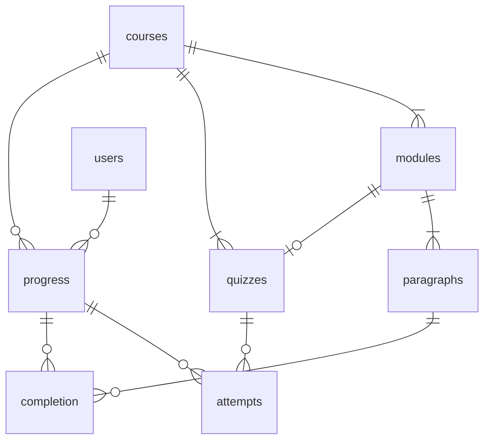

# CEC LMS Backend

Backend API built in Python with the Flask framework. Database is a Microsoft SQL Server.

## Database Tables




### Roles:

| Field | Type |
| ----- | ---- |
| `role_id` | `INT PK` |
| `title` | `NVARCHAR` |

- reader and admin

### Users:

| Field | Type |
| ----- | ---- |
| `user_id` | `INT PK` |
| `role_id` | `INT FK` |
| `employee_number` | `NVARCHAR` |
| `full_name` | `NVARCHAR` |
| `creation_time` | `DATETIME2` |

### Courses:

| Field | Type |
| ----- | ---- |
| `course_id` | `INT PK` |
| `title` | `NVARCHAR` |

- May add more fields for version information

### Modules:

| Field | Type |
| ----- | ---- |
| `module_id` | `INT PK` |
| `course_id` | `INK FK` |
| `title` | `NVARCHAR` |
| `ordinal` | `INT` |
| `paragraph_count` | `INT` |

### Quizzes:

| Field | Type |
| ----- | ---- |
| `quiz_id` | `INT PK` |
| `course_id` | `INT FK` |
| `module_id` | `INT FK` |
| `passing_score` | `INT` |
| `question_count` | `INT` |

- May add fields to describe connection to module

### UserCourseProgress:

| Field | Type |
| ----- | ---- |
| `user_id` | `INT FK` |
| `course_id` | `INT FK` |
| `active_module_id` | `INT FK` |
| `active_paragraph` | `INT` |
| `complete` | `BIT` |

- `(user_id, course_id)` is the primary key

### UserParagraphCompletion:

| Field | Type |
| ----- | ---- |
| `user_id` | `INT FK` |
| `course_id` | `INT FK` |
| `module_id` | `INT FK` |
| `paragraph_number` | `INT` |
| `completion_time` | `DATETIME2` |

- `(user_id, module_id, paragraph_number)` is the primary key

### UserQuizAttempts:

| Field | Type |
| ----- | ---- |
| `attempt_id` | `INT PK` |
| `user_id` | `INT FK` |
| `course_id` | `INT FK` |
| `quiz_id` | `INT FK` |
| `correct_answers` | `INT` |
| `submission_time` | `DATETIME2` |

## API Endpoints

```text
/
├── auth/
│   ├── login
│   ├── logout
│   └── me
├── course/<course_id>/
│   └── progress
└── quiz/<quiz_id>/
    └── attempts
```


### Auth

```http
POST /auth/login
```
```json
{
    "employee_number": "0TA16****",
    "full_name": "John Doe"
}
```
- determine `user_id`
- generate `Users` entry if does not exist
- set jwt cookie with `sub = user_id`

<br>

```http
POST /auth/logout
```
- clear jwt cookie

<br>

```http
GET /auth/me
```
- read `User` entry with id from jwt `sub`

<br>


### Course Progress

```http
GET /course/<course_id>/progress
```

- read `UserParagraphCompletion`, select all that correspond to current user and course

<br>

```http
POST /course/<course_id>/progress
```
```json
{
    "module_id": 1,
    "paragraph_number": 0
}
```
- create `UserCourseProgress` entry if not exists
- create `UserParagraphCompletion` entry 

<br>

```http
DELETE /course/<course_id>/progress
```
- Admin only

<br>


### Quiz Attempts

```http
GET /quiz/<quiz_id>/attempts
```
- `quiz_number` either a number or "final"
- response contains last quiz attempt score and maybe time

<br>

```http
POST /quiz/<quiz_id>/attempts
```
- request contains score of latest attempt
